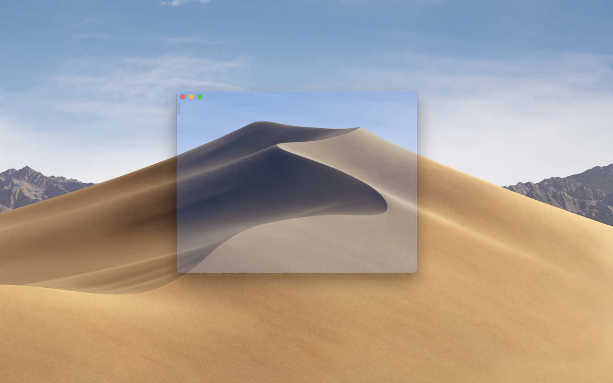
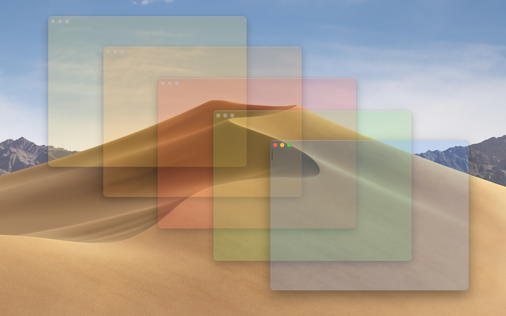
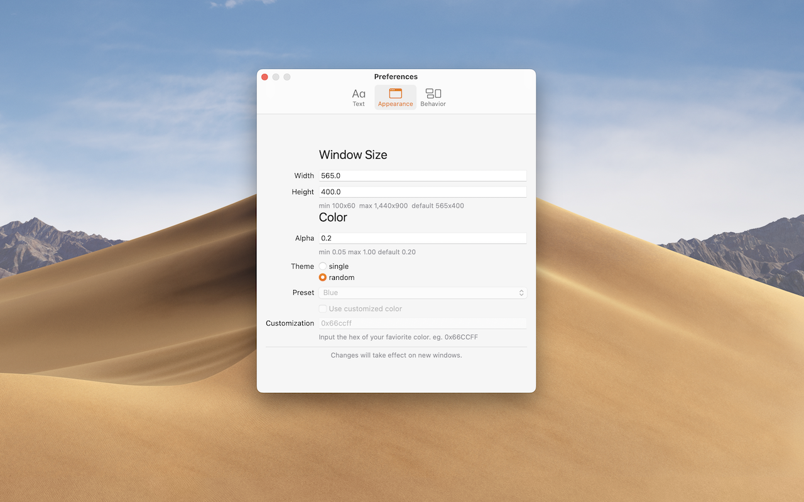

# 介绍 / Introduction

`Ex便签` 是macOS平台的一款桌面实用小工具。你可以使用 `Ex便签` 方便的在桌面上新建多个纯文本便签。`Ex便签` 提供了多个配置选项，你可以按照自己的喜好来选择便签的外观的显示方式。

---

`ExSticky` is a utility app on macOS. You can use `ExSticky` to create multiple handy stickies on your desktop. `ExSticky` provides several preferences that you can configure in your favor.

---

